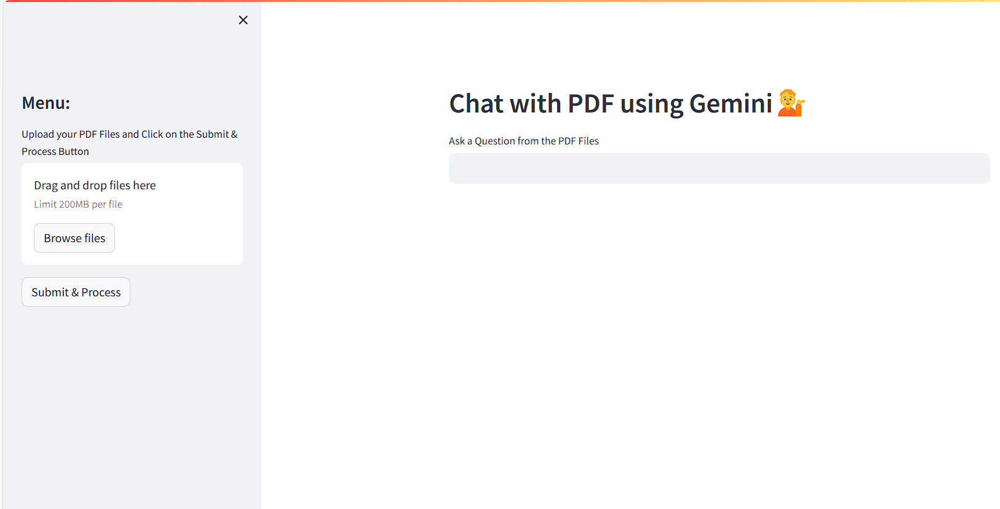

# PDF Chatbot Pro

PDF Chatbot Pro is an application that allows you to chat with multiple PDF documents using Langchain and Google Gemini Pro. It uses large language models to process natural language queries and extract information from the provided PDF documents.

## web app

## Table of Contents

- [Setup](#setup)
- [Usage](#usage)
- [Troubleshooting](#troubleshooting)
- [Contributions](#contributions)
- [License](#license)

## Setup

Follow these steps to set up PDF Chatbot Pro:

1. **Clone the Repository**:

    ```bash
    git clone <repository_url>
    cd pdf-chatbot-pro
    ```

2. **Create a .env file**:

    In the root directory of the project, create a `.env` file and add the following variables:

    ```plaintext
    GOOGLE_API_KEY=your_google_api_key
    ```

3. **Install Dependencies**:

    Install the required Python packages from the `requirements.txt` file:

    ```bash
    pip install -r requirements.txt
    ```

4. **Place PDF Documents**:

    Place your PDF documents in the specified directory (e.g., `pdf_documents/`) to allow the application to access them.

5. **Modify the app.py file**:

    Adjust any configuration settings in the `app.py` file to match your setup.

## Usage

1. **Run the application**:

    Start the application using Streamlit:

    ```bash
    streamlit run app.py
    ```

2. **Interact with the application**:

    Use the provided user interface to input natural language queries and chat with the PDF documents.

## Dependencies

- `streamlit`: For creating a user-friendly interface for the application.
- `google-generativeai`: For interacting with Google Gemini Pro.
- `python-dotenv`: For loading environment variables from the `.env` file.
- `langchain`: For enabling natural language processing and conversational AI capabilities.
- `PyPDF2`: For reading and manipulating PDF documents.
- `chromadb`: For managing and querying vectors in a database.
- `faiss-cpu`: For efficient vector similarity search.
- `langchain_google_genai`: For integrating Langchain with Google Gemini Pro.
- `langchain-community`: For additional Langchain-related functionality.

## Troubleshooting

- Ensure that the Google API key and other settings in the `.env` file are correct and up to date.
- Double-check your PDF file paths and document organization.
- If you encounter any errors, review the application logs for more details on the issue.

## Contributions

Contributions are welcome! Please submit a pull request with your changes.

## License

This project is licensed under the MIT License.
